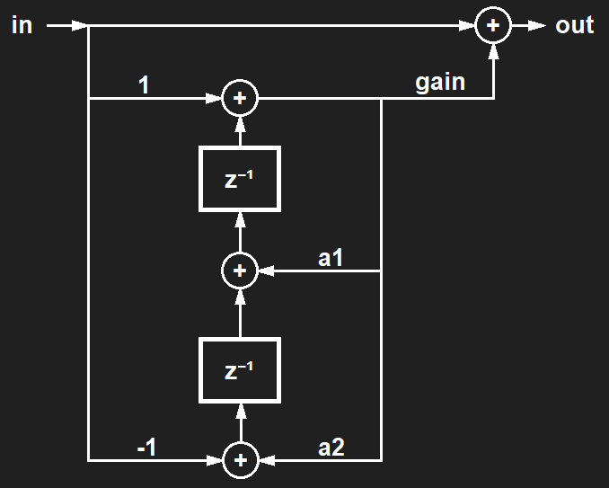

# speakertweaker-alsaplug
ALSA Plugin for tuning frequency response of your speakers.

With this ALSA plugin you can configure up to 16 filter stages, each of which amplifies or attenuates a frequency band with adjustable width. With this you can for example improve the sound of your self-built speakers by fine tuning the frequency response.

## Install
### To compile and install the ALSA-Plugin:
```
sudo make install
```

### Add the plugin to your ALSA configuration:
Example configuration:
```
pcm.!default {
    type softvol
    slave.pcm "speakertweaker_plug"
    control.name "PCM"
    control.card 0
}

pcm.speakertweaker_plug {
    type plug
    slave {
        pcm "speakertweaker"
        rate 44100
    }
}

pcm.speakertweaker {
    type speakertweaker
    slave.pcm "plug:dmixer"
}

pcm.dmixer {
  type dmix
  ipc_key 1024
  ipc_perm 0666
  slave {
    pcm "speaker"
    period_time 0
    period_size 1024
    buffer_size 8192
    rate 44100
    channels 2
  }
}

pcm.speaker {
  type hw card 0
}
```
- "pcm.speakertweaker_plug" defines an ALSA plug which is used to adjust the format of the audio signal to the requirements for the speakertweaker plugin. The speakertweaker plugin needs a sampling rate that matches the filter coefficients. The ALSA plug also automatically converts the samples to float values, which is also a requirement for our plugin.
- "pcm.speakertweaker" then adds the speakertweaker plugin into the audio stream.
- I recommend to install the master volume control in the stream before the Speakertweaker plugin. This has the advantage that you have more headroom for amplify certain frequencies before this leads to clipping due to an excessive audio level. Of course this is only useful if you use a softvol volume control that is not set to the maximum value, so that the level is reduced before our plugin.

### Add a filter file to your system:
In this repo you will find a default filter file with no filter active yet. This file must be present on your system for the plugin to work. The default location is: /var/lib/alsa/speakertweaker.bin
```
sudo mv var/lib/alsa/speakertweaker.bin /var/lib/alsa/speakertweaker.bin
```

## Filter file structure

speakertweaker.bin:
| Type             | Bytes | Name          | Description                                                     |
| ---------------- |------ | ------------- | --------------------------------------------------------------- |
| uint32           |     4 | version       | 1                                                               |
| uint32           |     4 | revision      | increment by 1 on each change                                   |
| uint32           |     4 | sampling_rate | sampling rate for which the filter coefficients were calculated |
| uint32           |     4 | num_filters   | number of active filters                                        |
| filterparams[16] |   192 | filter_params | 16x filter coefficients (see table below)                       |

filterparams:
| Type    | Bytes | Name | Description                        |
| ------- |------ | ---- | ---------------------------------- |
| float32 |     4 | a1   | a1 coefficient (see image below)   |
| float32 |     4 | a2   | a1 coefficient (see image below)   |
| float32 |     4 | gain | gain coefficient (see image below) |

Each time the file is written, the change is applied immediately if the revision is incremented (changed).
A tool with which the filter parameters can be easily calculated and the filter file can be created/changed is already work in progress and will be linked here as soon as it is available.

## How the filter works
The filter stages are designed according to the following schematic:



The IIR filter is designed to require as little processing power as possible, so that even on hardware such as the Raspberry Pi Zero, only a small portion of the available processing power is required:
- In contrast to regular IIR filters, the b coefficients were not used, respectively they were fixed to 1, 0 and -1.
- The input is passed through additively to the output.
- By choosing the filter coefficients a1, a2 and gain, it is possible to amplified or attenuated the desired frequency range with a certain width.
- In order to correct more than one frequency range or to get a steeper filter, several filter stages can be chained.
